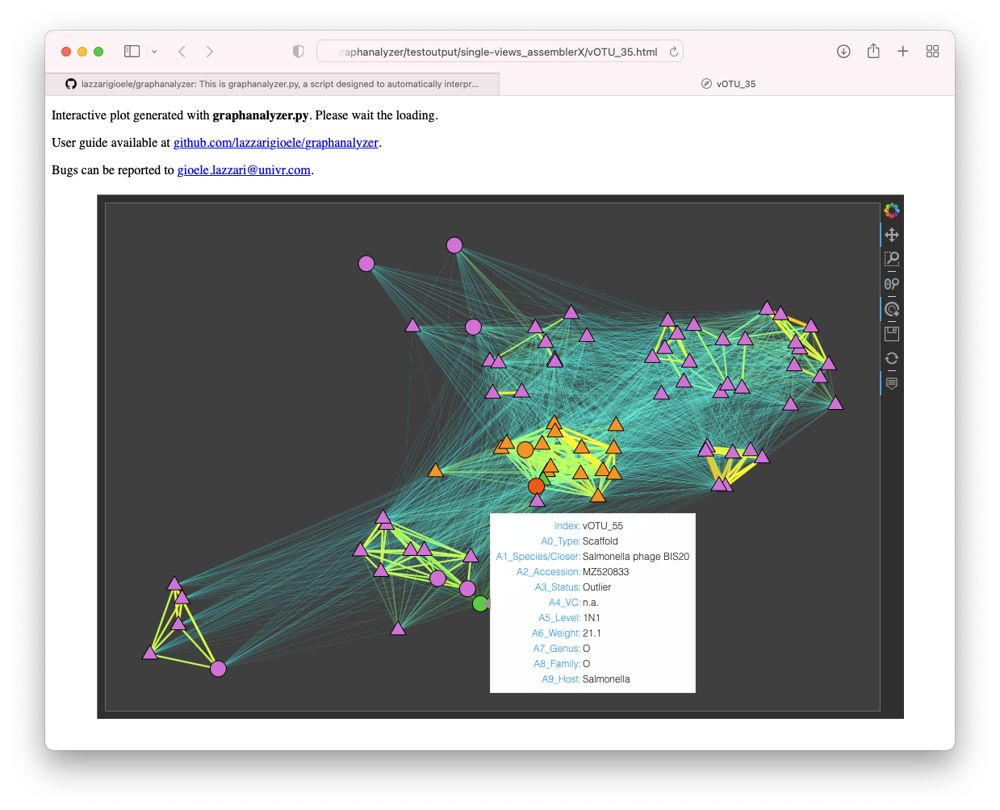
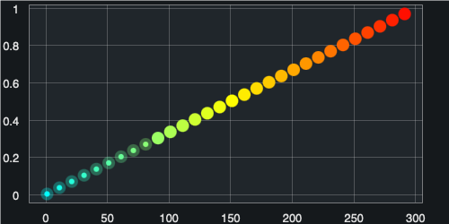

This is `graphanalyzer.py`, a script designed to automatically interpret the outputs generated by **vConTACT2** when using the **INPHARED** database. 




## Introduction

[INPHARED](https://github.com/RyanCook94/inphared) provides a curated database of phage genomes monthly updated. Moreover it provides the input files to work with vConTACT2, namely the `proteins.faa` and the `gene_to_genome.csv`. Both these files are based on the "excluding_refseq" version of the INPHARED genome database. As we can read on https://github.com/RyanCook94/inphared at date 24-11-2021, this is because GenBank already inglobes RefSeq genomes: "This avoids duplicated sequences, as RefSeq genomes are listed in Genbank with two separate accessions". So, when using these files as input for vConTACT2, one must rely on `data_excluding_refseq.tsv` (always provided by INPHARED) in order to retrive the taxonomic information related to each GenBank sequence. 

The two main outputs generated by [vConTACT2](https://bitbucket.org/MAVERICLab/vcontact2/) are the `genome_by_genome_overview.csv` and the `c1.ntw`. The first contains information like the initial viral cluster (eg VC_22), the refined viral cluster (eg VC_22_1), the confidence metrics, and misc scores. The second contains the description of the graph generated by vConTACT2, that is the source / target / edge weight information for all genome pairs "higher than the significance threshold as determined by the probability that those two genomes would share N genes". Unfortunately, for each user viral sequence (hereafter: vOTU), vConTACT2 doesn't provide a direct taxonomic association: the authors suggest the user to manually inspect the `genome_by_genome_overview.csv` and the `c1.ntw` in order to associate every vOTU with the taxonomy of a viral reference. In fact, on https://bitbucket.org/MAVERICLab/vcontact2/ at date 24-11-2021, it's possible to read what follows:

> One important note is that the taxonomic information is not included for user sequences. This means that each user will need to find their genome(s) of interest and check to see if reference genomes are located  in the same VC. If the user genome is within the same VC subcluster as a reference genome, then there's a very high probability that the user genome is part of the same genus. If the user genome is in the same VC but not the same subcluster as a reference, then it's highly likely the two genomes are related at roughly genus-subfamily level. If there are no reference genomes in the same VC or VC subcluster, then it's likely that they are not related at the genus level at all. That said, it is possible they could be related at a higher taxonomic level (subfamily, family, order).

`graphanalyzer.py`was written to try to automate the manual inspection of the vConTACT2 outputs, providing the user a direct taxonomic association for every vOTU. 


## Installation

### BioConda installation

`graphanalyzer.py` is available from [BioConda](https://bioconda.github.io/recipes/graphanalyzer/README.html):

```bash
conda install -c bioconda -c conda-forge graphanalyzer
```

### Dependencies and environments

`graphanalyzer.py` is a Python 3.7 script and should run on every UNIX system. It mainly relies on **networkx** library (https://networkx.org) to work with graphs and **pandas** library (https://pandas.pydata.org) to work with tables. The script also uses some other external libraries (maily [hvPlot](https://hvplot.holoviz.org), [openpyxl](https://openpyxl.readthedocs.io/) and [pygraphviz](https://pygraphviz.github.io)) and we suggest to run it into a dedicated conda environment created as follows.

For both MacOSX and Linux we also provide a handy definition of the minimum conda environment. You can find it at `./env_macosx.yml` and `./env_linux.yml`. Given this definition, you can easily create the right conda environment using the following command `conda env create -f ./env_macosx.yml.yml`. 


## Usage

`graphanalyzer.py` interpret the outputs generated by vConTACT2 when using the INPHARED database. It requires 3 files in input: `genome_by_genome_overview.csv`, `c1.ntw`, and `data_excluding_refseq.tsv` (see Introduction). Below its usage:

    python graphanalyzer.py \
    --graph c1.ntw \
    --csv genome_by_genome_overview.csv \
    --metas data_excluding_refseq.tsv \
    --output ./ \
    --suffix your_suffix

`--output` defines the output directory (the path provided must exist). `--suffix` defines a suffix appended to each file produced in the ouput directory. The viral scaffold to classify, contained in `genome_by_genome_overview.csv` and `c1.ntw`, must be named vOTU_1, vOTU_2, vOTU_3, etc. On this repository you can find `testinput.tar.gz`, which contains all the 3 input files described, and can be used to test `graphanalyzer.py`. Files contained in `testinput.tar.gz` were generated using a development version of "MetaPhage" (https://github.com/MattiaPandolfoVR/MetaPhage), a pipeline from the same group, using these SRA accessions: SRR8653043, SRR8653044, SRR8653201, SRR8653228, SRR8653178, SRR8653224, SRR8653227, SRR8653123, SRR8653095, SRR8653046, SRR8653124, SRR8652952, SRR8653202, SRR8653045, SRR8652951, SRR8653177, SRR8653042, SRR8653040, SRR8653094, SRR8653041, SRR8653229, SRR8653125, SRR8653225, SRR8653200, SRR8653226.


## Description of the main algorithm

The software takes into consideration the information contained in the following two files: `genome_by_genome_overview.csv`, that contains the eventual cluster (VC_z) and subcluster (VC_z_k) information for every viral scaffold and reference genome; `c1.ntw`, that contains the information about the weighted network. A node can be a vOTUs or a reference genome, while the weight associated to each edge connecting pairs of nodes is a measure of how much two genomes are related.

In the `genome_by_genome_overview.csv` output, each genome can be associated to a different "Status". Here the list and the meaning of the different "Status" flag:

- `Singleton`: it's never included inside the graph; it never falls inside a VC_z.
- `Outlier`: it's always included inside the graph; it never falls inside a VC_z.
- `Clustered`: it's always included inside the graph; it shares a VC_z_k with at least one other sequence.
- `Clustered/Singleton`: it's always included inside the graph; it's the only one inside its VC_z_k. 
- `Overlap`: it's always included inside the graph; it never falls inside a VC_z_k; it could belong to two or more VC_z at the same time.

Below we report the main steps of the algorithm:

1. Separate vOTUs from reference genomes.
2. Separate vOTUs contained in the graph from the other vOTUs (that is: remove all `Singleton`). vOTUs that are not cotained in the graph can't inherit a taxonomy and will be marked in the results table as `G` (that stands for _"not in the Graph"_). 
3. Iterate trough each vOTU in the graph that has not inherited a taxonomy yet.
    1. Retrive all its 1st-level neighbors (that are: nodes directly connected with one edge).
    2. Retrive all the sequences grouped inside the same VC_z/VC_z_k based on the Status:
        1. If `Outlier` there is nothing to do (because it never falls inside a VC_z/VC_z_k)
        2. If `Clustered` get the sequences that share the same subcluster (VC_z_k).
        3. If `Clustered/Singleton` get the sequences that share the same cluster (VC_z).
        4. If `Overlap` get the sequences inside all the given equivalent clusters (VC_z1, VC_z2, etc.)
    3. Compute the list of the sequences that are both clustered together AND 1st-level neighbors. Order the list by weight.
    4. If a reference genome exist inside this list, inherit the taxonomy from the first one (heavier weight) and exit. This vOTU will be marked as `XCn` in the results table, were `X`=1) and `n` is the order of the first reference genome inside this list. 
    5. If no reference genome is found, compute a new list with all sequences that are JUST 1st-level neighbors. Order this new list by weight. 
    6. If a reference genome exist inside this second list, inherit the taxonomy from the first one (heavier weight) and exit. This vOTU will be marked as `XNn` in the results table, were `X`=1 and `n` is the order of the first reference genome inside this second list. 
4. Repeat everything again considering as reference genomes also the vOTUs that have previously inherited a taxonomy. New classified vOTU will be marked in the results table as `XCn` or `XNn` with `X`=2, 3, etc depending on the iterations done. Stop the iterations and exit when no new classifications are done. 
5. vOTUs that still have not inherited a taxonomy will be marked in the results table with `F` (that stands for _"Failed to assign taxonomy"_).


## Interpretation of results

The `graphanalyzer.py` script produces several outputs in the `--output` folder. They are briefly discussed below. 

- `csv_edit_your_suffix.xlsx` this is a copy of the vConTACT2's `genome_by_genome_overview.csv` updated with the infomation coming from the IPHARED's `data_excluding_refseq.tsv`. The original vConTACT2 columns regarding the taxonomy are: `Genome`, `Order`, `Family`, `Genus`. Thanks to INPHARED we've added several new columns like: `Host`, `BalitmoreGroup`, `Realm`, `Kingdom`, `Phylum`, `Class`. Here, rows concerning vOTUs are not modified. Some taxonomy levels (like `Kingdom`, `Phylum`, and `Class`) are inferred by the INPHARED's _Classification_ column searching for specific suffixes (like _-virae_ for Kingdom, _-viricota_ for Phylum, and _-viricetes_ for Class).

- `results_vcontact2_your_suffix.xlsx` contains the results of the main algorithm. Columns are: `Scaffold`, the ID of the viral  scaffold (eg: vOTU_1, vOTU_2, etc); `Closer`, the species of reference genome from which the vOTU inherits the taxonomy; `Accession`, the accession of the _Closer_ species; `Status`, the Status of the vOTU determined by vConTACT2 (Singleton, Outlier, Clustered, Clustered/Singleton, Overlap; see above for a description of each Status); `VC`, the viral subcluster (if any) determined by vConTACT2; `Level`, the level of confidence determined by the main algorithm (G, F, XCn, XNn; see above for a description of each Level); `Weight`, the weight attribute of the edge connecting the node from which the vOTU inherit the taxonomy (see above for more information on the weight); `Host` host infected as reported on the INPHARED database; `BaltimoreGroup`, `Realm`, `Kingdom`, `Phylum`, `Class`, `Order`, `Family`, `Subfamily`, `Genus`, different levels of the taxonomy inherited from the reference genome. Taxonomy in this results table is cut to "Subfamily" for vOTUs having Status "Clustered/Singleton" or "Overlap" and Level of "XCn" type; if Level is of "XNn" type, than taxonomy is cut to "Order" instead. Each cut level is reported with "O" (that stands for _"Omitted taxonomy level"_).

- `graph_layout_your_suffix.html` interative rapresentation of the whole graph. 1Cn vOTUs are in red. Not assigned vOTUs (the 'F' ones) are in blue. The rest of the assigned vOTUs are in orange. Reference genomes are in aquamarine. User can hover each node with the mouse to show the attributes of that node (like Species, Accession, VC, Level, Weight, Genus, Family, Host; previously described). Please note: this file will be probably too heavy to be loaded or usable on your browser.

- `single-views/vOTU_X.html` described in the next chapter.

- Other debug files not useful for the final user. 


## Description of "single views"

This program also produces an interactive sub-graph for each of the vOTUs contained in the whole graph. They will be placed in `single-views/vOTU_X.html`. As they contain much less nodes and edges then the whole graph, they are lighter to be rendered and thus usable in normal computers.

Each sub-graph contains the vOTU of interest in red and all its 1st-level neighbors, that are the nodes directly connected to it. Rounded nodes are other vOTUs, while triangular nodes are reference genomes. If present, the reference genome from which the vOTUs inherit the taxonomy is depicted in green. 

Generally nodes are magenta colored, while those taking part of the same viral cluster of the vOTU are colored differently. If the vOTU is 'Clustered', the user will find genomes of the same VC_z_k in orange, and genomes of others VC_z in yellow. If the vOTU is 'Clustered/Singleton', genomes of the same VC_z are shown in yellow. If the vOTU is 'Overlap', genomes of every overlapping VC_z are shown in yellow. 

The user can hover each node with the mouse to show the attributes of that node (like Species, Accession, VC, Level, Genus, Family, Host; previously described); the attribute "A6_Weight" is the weight of the edge connecting that node to the currend vOTU. 

Nodes are disposed approximately respecting the edges' weight. This tend to spatially group nodes in their respective clusters. Moreover, color and width of each edge is proportional to its weight and scaled to the heavier edge in the whole graph: this makes sub-graphs comparable to each other and strongly improves the visibility of clusters. If the edge's weight is less than 30% of the maximum, that edge is plotted with transparency. This allows clusters to better pop-up and be visible at first sight. Below is reported the color scale taking for example a maximum weight of 300.



We suggest to use the "scroll-to-zoom" tool in the toolbox, to zoom in and out the sub-graph. We suggest also to click on a desired node to show only the edges starting from that node, hiding all the ramaining. The dark background lets the user better isolate edges when clicking on the desired node.

## Bugs and future versions

Bugs can be reported to gioele.lazzari@univr.it. Future versions of graphanalyzer will be available at www.github.com/lazzarigioele/graphanalyzer/releases.
