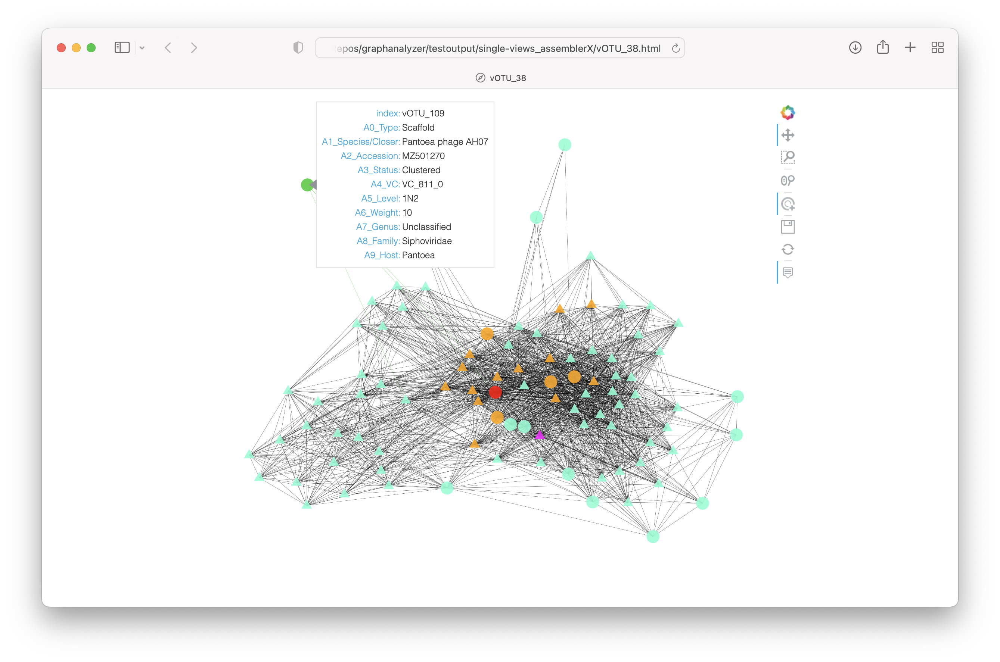

This is `graphanalyzer.py`, a script designed to automatically interpret the outputs generated by **vConTACT2** when using the **INPHARED** database. 

# Introduction

INPHARED provides a curated database of phage genomes monthly updated. Moreover it provides the input files to work with vConTACT2, namely the `proteins.faa` and the `gene_to_genome.csv`. Both these files are based on the "excluding_refseq" version of the INPHARED genome database. As we can read on github.com/RyanCook94/inphared at date 24-11-2021, this is because GenBank already inglobes RefSeq genomes: "This avoids duplicated sequences, as RefSeq genomes are listed in Genbank with two separate accessions". So, when using these files as input for vConTACT2, one must rely on `data_excluding_refseq.tsv` (always provided by INPHARED) in order to retrive the taxonomic information related to each GenBank sequence. 

The two main outputs generated by vConTACT2 are the `genome_by_genome_overview.csv` and the `c1.ntw`. The first contains information like the initial viral cluster (eg VC_22), the refined viral cluster (eg VC_22_1), the confidence metrics, and misc scores. The second contains the description of the graph generated by vConTACT2, that is the source / target / edge weight information for all genome pairs "higher than the significance threshold as determined by the probability that those two genomes would share N genes". Unfortunately, for each user-inputted viral sequence (hereafter: vOTU), vConTACT2 doesn't provide a direct taxonomic association: the authors want the user to manually inspect the `genome_by_genome_overview.csv` and the `c1.ntw` in order to associate every vOTU with the taxonomy of a viral reference. In fact, on bitbucket.org/MAVERICLab/vcontact2/ at date 24-11-2021, it's possible to read what follows:

> One important note is that the taxonomic information is not included for user sequences. This means that each user will need to find their genome(s) of interest and check to see if reference genomes are located  in the same VC. If the user genome is within the same VC subcluster as a reference genome, then there's a very high probability that the user genome is part of the same genus. If the user genome is in the same VC but not the same subcluster as a reference, then it's highly likely the two genomes are related at roughly genus-subfamily level. If there are no reference genomes in the same VC or VC subcluster, then it's likely that they are not related at the genus level at all. That said, it is possible they could be related at a higher taxonomic level (subfamily, family, order).

Here enters `graphanalyzer.py`: this script tries to automate the manual inspection of the vConTACT2 outputs, providing the user a direct taxonomic association for every vOTU. 

# Dependencies

`graphanalyzer.py` is Python 3.7 script developed locally on a 2019 Intel MacBook Pro machine, but it should run on every UNIX system. It mainly relies on **networkx** (networkx.org) to work with graphs and **pandas** (pandas.pydata.org) to work with tables. The script also uses some other external libraries and we suggest to run it into a dedicated conda environment created as follows.

For MacOSX:

    conda create --name graphanalyzer -y
    conda activate graphanalyzer
    conda install pygraphviz==1.6=py37hd4be98e_1 -c conda-forge
    conda install pandas openpyxl networkx hvplot -c conda-forge

For Linux:

    conda create --name graphanalyzer -y
    conda activate graphanalyzer
    conda install pygraphviz==1.7=py37h0b1d2a2_0 -c conda-forge
    conda install pandas openpyxl networkx hvplot -c conda-forge

For both MacOSX and Linux we provide also a handy definition of the minimum conda environment. You can find it at `./env_macosx.yml` and `./env_linux.yml`. Given this definition, you can easily create the right conda environment with for example `conda env create -f ./env_macosx.yml.yml`. 

# Usage

`graphanalyzer.py` interpret the outputs generated by vConTACT2 when using the INPHARED database. It requires 3 files in input: `genome_by_genome_overview.csv`, `c1.ntw`, and `data_excluding_refseq.tsv` (see Introduction). Below its usage:

    python graphanalyzer.py \
    --graph c1.ntw \
    --csv genome_by_genome_overview.csv \
    --metas data_excluding_refseq.tsv \
    --output ./ \
    --suffix your_suffix

`--output` defines the output directory (the path provided must exist). `--suffix` defines a suffix appended to each file produced in the ouput directory. The viral scaffold to classify, contained in `genome_by_genome_overview.csv` and `c1.ntw`, must be named vOTU_1, vOTU_2, vOTU_3, etc. On this repository you can find `testinput.tar.gz`, which contains all the 3 input files described, and can be used to test `graphanalyzer.py`. Files contained in `testinput.tar.gz` were generated using a development version of "MetaPhage", a pipeline from the same group, using these SRA accessions: SRR8653043, SRR8653044, SRR8653201, SRR8653228, SRR8653178, SRR8653224, SRR8653227, SRR8653123, SRR8653095, SRR8653046, SRR8653124, SRR8652952, SRR8653202, SRR8653045, SRR8652951, SRR8653177, SRR8653042, SRR8653040, SRR8653094, SRR8653041, SRR8653229, SRR8653125, SRR8653225, SRR8653200, SRR8653226.

# Description of the main algorithm

This software tries to replicate what a human could do when interpretating the vConTACT2 outputs. These contain two different kinds of informations: `genome_by_genome_overview.csv` associate to every viral scaffold to classify (hereafter: vOTU) and to every reference genome a viral cluster (VC_z) and a viral subcluster (VC_z_k) if possible; `c1.ntw` defines the edges connecting vOTUs and reference genomes, and each edge is associated to a weight, that is a measure of of much two genomes are related. Thus, this software try to exploit the informations contained in both these file to assign the best taxonomy to each vOTU. 

In the `genome_by_genome_overview.csv` output, one can find a certain "Status" associated to each genome. What follows is what I've understood manually inspecting this file.

- `Singleton`: it's never included inside the graph; it never falls inside a VC_z.
- `Outlier`: it's always included inside the graph; it never falls inside a VC_z.
- `Clustered`: it's always included inside the graph; it shares a VC_z_k with at least one other sequence.
- `Clustered/Singleton`: it's always included inside the graph; it's the only one inside its VC_z_k. 
- `Overlap`: it's always included inside the graph; it never falls inside a VC_z_k; it could belong to two or more VC_z at the same time.

Below we report some step of the main algorithm to give you an idea.

1. Separate vOTUs from reference genomes.
2. Separate vOTUs contained in the graph from the other vOTUs (that is: remove `Singleton`s). vOTUs that are not cotained in the graph can't inherit a taxonomy and will be marked in the results table as `G`. 
3. Iterate trough each vOTU in the graph that has not inherited a taxonomy yet.
    1. Get its 1st-level neighbors (that are: nodes directly connected with one edge).
    2. Get the sequences grouped inside the same VC_z/VC_z_k based on the Status:
        1. If `Outlier` there is nothing to do (because it never falls inside a VC_z/VC_z_k)
        2. If `Clustered` get the sequences that share the same subcluster (VC_z_k).
        3. If `Clustered/Singleton` get the sequences that share the same cluster (VC_z).
        4. If `Overlap` get the sequences inside the all the given equivalent clusters (VC_z1, VC_z2, etc.)
    3. Get the list of sequences clustered together and 1st-level neighbors, ordered by weight.
    4. If a reference genome exist inside this list, inherit the taxonomy from the first one (heavier weight) and exit. This vOTU will be marked as `XCn` in the results table, were `X`=1 and `n` is the order of the first reference genome inside this list. 
    5. If no reference genome was found, get the list of all 1st-level neighbors, ordered by weight. 
    6. If a reference genome exist inside this second list, inherit the taxonomy from the first one (heavier weight) and exit. This vOTU will be marked as `XNn` in the results table, were `X`=1 and `n` is the order of the first reference genome inside this list. 
4. Repeat everything again considering as reference genomes also the vOTUs that have previously inherited a taxonomy. New classified vOTU will be marked in the results table as `XCn` or `XNn` with `X`=2, 3, etc depending on the iterations done. Stop the iterations and exit when no new classifications are done. 
5. vOTUs that still have not inherited a taxonomy will be marked in the results table with `F`.

# Interpretation of results

The `graphanalyzer.py` script produces several outputs in the `--output` folder. They are briefly discussed below. 

- `csv_edit_your_suffix.xlsx` this is a copy of the vConTACT2's `genome_by_genome_overview.csv` updated with the infomation coming from the IPHARED's `data_excluding_refseq.tsv`. Columns coming from vConTACT2 are and regarding the taxonomy are: `Genome`, `Order`, `Family`, `Genus`. Thanks to INPHARED we've added several new columns like: `Host`, `BalitmoreGroup`, `Realm`, `Kingdom`, `Phylum`, `Class`. Here, rows concerning vOTUs are left untouched. 
- `results_vcontact2_your_suffix.xlsx` contains the results of the main algorithm. Columns are: `Scaffold`, the ID of the viral  scaffold (eg: vOTU_1, vOTU_2, etc); `Closer`, the species of reference genome from which the vOTU inherits the taxonomy; `Accession`, the accession of the _Closer_ species; `Status`, the Status of the vOTU (Singleton, Outlier, Clustered, Clustered/Singleton, Overlap; see above for a description of each Status); `VC`, the viral subcluster determined by vConTACT2; `Level`, the level of confidence determined by the main algorithm (G, F, XCn, XNn; see above for a description of each Level); `Weight`, the weight attribute of the edge connecting the node from which the vOTU inherit the taxonomy (see above for more information on the weight); `Host` host infected as reported on the INPHARED database; `BaltimoreGroup`, `Realm`, `Kingdom`, `Phylum`, `Class`, `Order`, `Family`, `Subfamily`, `Genus`, different levels of the taxonomy inherited from the reference genome.
- `graph_layout_your_suffix.html` interative rapresentation of the whole graph. 1Cn vOTUs are in red. Not assigned vOTUs (the 'F' ones) are in blue. The rest of the assigned vOTUs are in orange. Reference genomes are in aquamarine. You can hover each node with the mouse to show the attributes of that node (like Species, Accession, VC, Level, Weight, Genus, Family, Host; previously described). Please note: this file will be probably too heavy to be loaded or usable on your browser.
- `single-views/vOTU_X.html` described in the next chapter.
- Other debug files not useful for the final user. 

# Description of 'single views'

This program also produces an interactive sub-graph for each of the vOTUs contained in the whole graph. They will be placed in `single-views/vOTU_X.html`. As they contain much less nodes and edges then the whole graph, they are lighter to render and thus usable in normal computers.

Each sub-graph contains the vOTU under exam in red and all its 1st-level neighbors, that are the nodes directly connected to it. Big rounded nodes are other vOTUs, while little triangular nodes are reference genomes. If present, the reference genome from which the vOTUs inherit the taxonomy is depicted in magenta. Generally nodes are aquamarine colored, while those taking part of the same viral cluster of the vOTU are colored differently. If the vOTU is 'Clustered', the user will find genomes of the same VC_z_k in orange. If the vOTU is 'Clustered/Singleton', genomes of the same VC_z are shown in yellow. If the vOTU is 'Overlap', genomes of every overlapping VC_z are shown in yellow. The user can hover each node with the mouse to show the attributes of that node (like Species, Accession, VC, Level, Weight, Genus, Family, Host; previously described).
