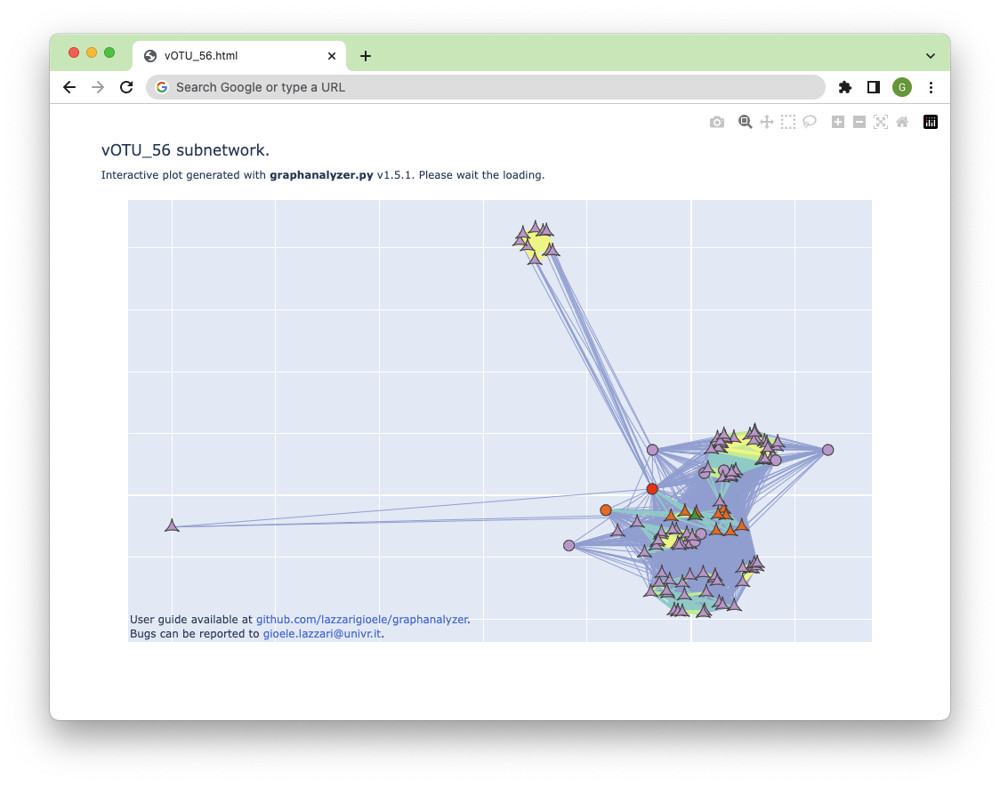
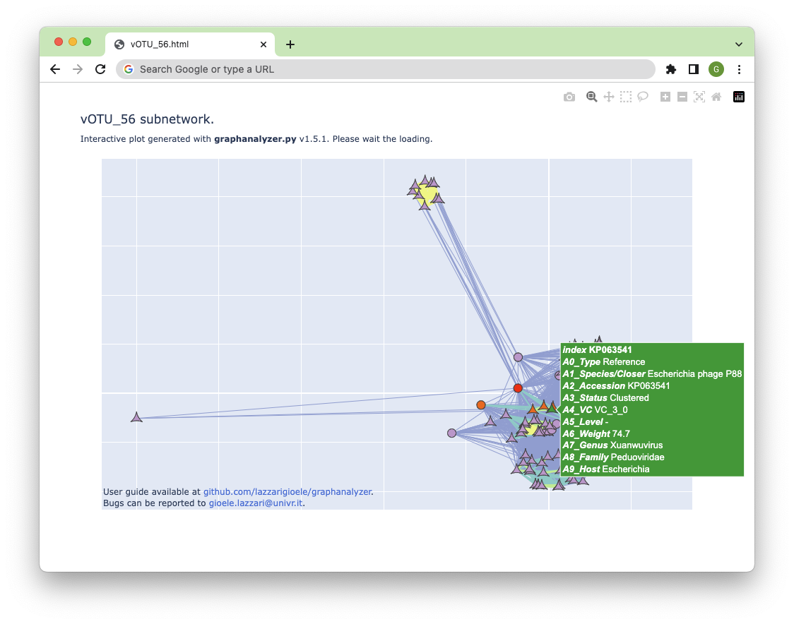
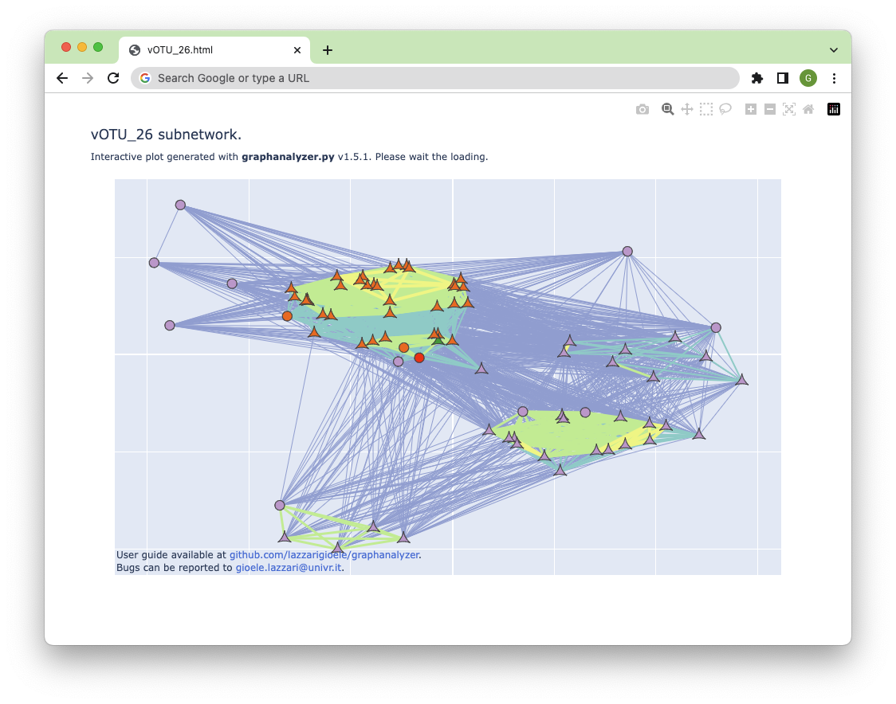
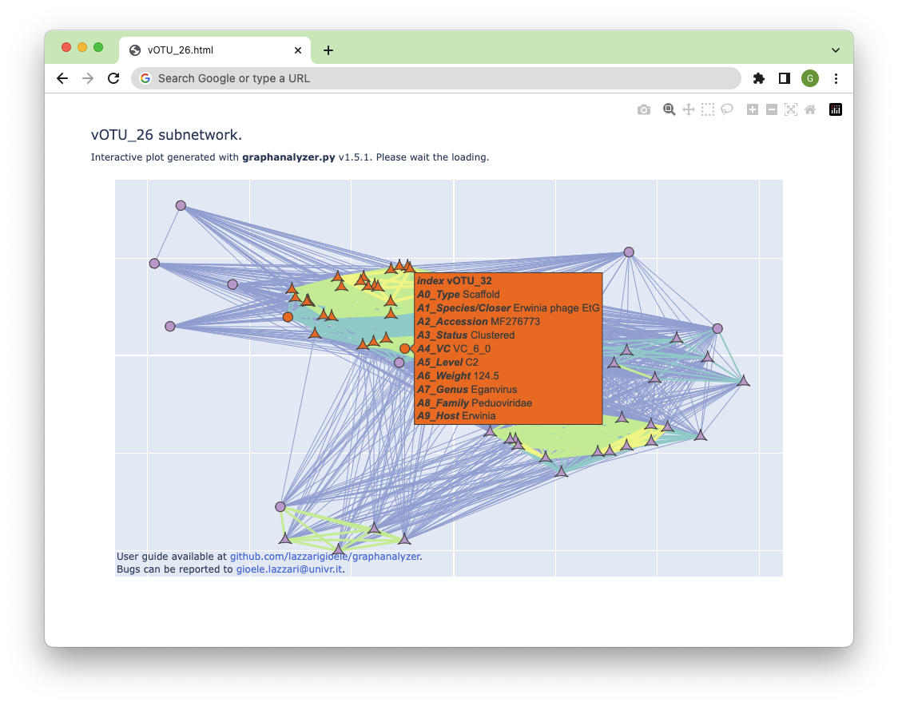

This is `graphanalyzer.py`, a script designed to automatically interpret the outputs generated by **vConTACT2** when using the **INPHARED** database. 

* [Introduction](https://github.com/lazzarigioele/graphanalyzer#introduction) - which needs we are trying to satisfy
* [Installation and usage](https://github.com/lazzarigioele/graphanalyzer#installation-and-usage) - how to get started
* [Main algorithm](https://github.com/lazzarigioele/graphanalyzer#main-algorithm) - description of what's under the hood
* [Results files](https://github.com/lazzarigioele/graphanalyzer#results-files) - description of the output files provided
* [Interactive "single views"](https://github.com/lazzarigioele/graphanalyzer#interactive-single-views) - how to use interactive subgraphs
* [Tutorial](https://github.com/lazzarigioele/graphanalyzer#tutorial) - how to interpret outputs, explained with real cases
* [Bugs and future versions](https://github.com/lazzarigioele/graphanalyzer#bugs-and-future-versions) - how to keep in contact
* [How to cite](https://github.com/lazzarigioele/graphanalyzer#how-to-cite)
* [Known issues](https://github.com/lazzarigioele/graphanalyzer#known-issues)


## Introduction

[INPHARED](https://github.com/RyanCook94/inphared) provides a curated database of phage genomes monthly updated. Moreover it provides the input files to work with vConTACT2, namely the `proteins.faa` and the `gene_to_genome.csv`. Both these files are based on the "excluding_refseq" version of the INPHARED genome database. As we can read on https://github.com/RyanCook94/inphared at date 24-11-2021, this is because GenBank already inglobes RefSeq genomes: "_This avoids duplicated sequences, as RefSeq genomes are listed in Genbank with two separate accessions_". So, when using these files as input for vConTACT2, one must rely on `data_excluding_refseq.tsv` (always provided by INPHARED) in order to retrive the taxonomic information related to each GenBank sequence. 

The two main outputs generated by [vConTACT2](https://bitbucket.org/MAVERICLab/vcontact2/) are the `genome_by_genome_overview.csv` and the `c1.ntw`. The first contains information like the initial viral cluster (eg VC_22), the refined viral cluster (eg VC_22_1), the confidence metrics, and misc scores. The second contains the description of the graph generated by vConTACT2, that is the source / target / edge weight information for all genome pairs "_higher than the significance threshold as determined by the probability that those two genomes would share N genes_". Unfortunately, for each user viral sequence (hereafter: vOTU), vConTACT2 doesn't provide a direct taxonomic association: the authors suggest the user to manually inspect the `genome_by_genome_overview.csv` and the `c1.ntw` in order to associate every vOTU with the taxonomy of a viral reference. In fact, on https://bitbucket.org/MAVERICLab/vcontact2/ at date 24-11-2021, it's possible to read what follows:

> One important note is that the taxonomic information is not included for user sequences. This means that each user will need to find their genome(s) of interest and check to see if reference genomes are located in the same VC. If the user genome is within the same VC subcluster as a reference genome, then there's a very high probability that the user genome is part of the same genus. If the user genome is in the same VC but not the same subcluster as a reference, then it's highly likely the two genomes are related at roughly genus-subfamily level. If there are no reference genomes in the same VC or VC subcluster, then it's likely that they are not related at the genus level at all. That said, it is possible they could be related at a higher taxonomic level (subfamily, family, order).

`graphanalyzer.py` was written to try to automate the manual inspection of the vConTACT2 outputs, providing the user a direct taxonomic association for every vOTU, plus a bunch of interactive graphs. 

## Installation and usage

### Installation with bioconda (recommended)

`graphanalyzer.py` is now available on [bioconda](https://anaconda.org/bioconda/graphanalyzer) (thanks to [Andrea Telatin](https://github.com/telatin)). The installation is thus really simple:

```bash
conda install -c bioconda -c conda-forge graphanalyzer
```

### Manual installation

`graphanalyzer.py` is a Python script and should run on every UNIX system, but it was tested only under Linux. It relies on some external libraries like [networkx](https://networkx.org), [pandas](https://pandas.pydata.org), [plotly](https://plotly.com), [openpyxl](https://openpyxl.readthedocs.io/) and [pygraphviz](https://pygraphviz.github.io). We suggest to run it into a dedicated conda environment. We provide a precise definition of the conda environment required for running `graphanalyzer.py`, you can find it at `reprod/graphanalyzer.yml`. Given this definition, you can easily create the right conda environment using the following command `conda env create -f reprod/graphanalyzer.yml`. 

In case all the above installation methods don't work, we also provide a Docker image with vConTACT2 v0.11.3 and all the dependencies for `graphanalyzer.py`. You can find it at https://hub.docker.com/r/lazzarigioele/graphanalyzer. It's the same image we use for the development of this repository. 

### Command line interface

`graphanalyzer.py` interpret the outputs generated by vConTACT2 when using the INPHARED database. It requires 3 files in input: `genome_by_genome_overview.csv`, `c1.ntw`, and `data_excluding_refseq.tsv` (see Introduction). Below its usage:

    python graphanalyzer.py \
    --graph c1.ntw \
    --csv genome_by_genome_overview.csv \
    --metas data_excluding_refseq.tsv \
    --output ./ \
    --prefix your_prefix \
    --suffix your_suffix \
    --threads nthreads_available \
    --view 2d

`--output` (or `-o`) defines the output directory (the path provided must exist). \
`--suffix` (or `-s`) defines a suffix appended to each file produced in the ouput directory. \
`--prefix` (or `-p`) defines the prefix that distinguishes the vOTUs in input from the other genomes. This means that the viral scaffolds to classify, contained in `genome_by_genome_overview.csv` and `c1.ntw`, must be named starting with "vOTU" if `--prefix vOTU`, like eg vOTU_1, vOTU_2, vOTU_3, etc. \
`--threads` (or `-t`) defines how many threads you want to use (default is 4). The higher this number, the quicker will be the execution.
`--view` (or `-w`) defines which type of interactive graphs to produce. It can be `2d` or `3d` (default is `2d`). 

### Test input files

We provide several example datasets you can use to test `graphanalyzer.py`:

* `testinput/testinput-small.tar.gz`. Files contained were generated using a development version of "MetaPhage" (https://github.com/MattiaPandolfoVR/MetaPhage), a pipeline from the same group, using these SRA accessions: SRR8653043, SRR8653044, SRR8653201, SRR8653228, SRR8653178, SRR8653224, SRR8653227, SRR8653123, SRR8653095, SRR8653046, SRR8653124, SRR8652952, SRR8653202, SRR8653045, SRR8652951, SRR8653177, SRR8653042, SRR8653040, SRR8653094, SRR8653041, SRR8653229, SRR8653125, SRR8653225, SRR8653200, SRR8653226. The pipeline used vConTACT2 v0.9.19. The provided INPHARED version in `1Nov2021`. To be used with `--prefix vOTU`.
* `testinput/testinput-big.tar.gz`. A bigger, real-world dataset. Used vConTACT2 v0.9.19 and INPHARED `1Mar2023`.  To be used with `--prefix vOTU`.
* `testinput/testinput-new.tar.gz`. This comes out from the [same example dataset you can find on the vConTACT2 repository](https://bitbucket.org/MAVERICLab/vcontact2/src/master/test_data/) (`VIRSorter_genomes*`, accessed on 20-10-2023). Files provided were generates with vConTACT2 v0.11.3 using the INPHARED db version `1Oct2023`. To be used with `--prefix VIRSorter_NODE_`. Read the next paragraph to see how we run vConTACT2 with INPHARED.

### Using vConTACT2 with INPHARED

Here we report how we use vConTACT2 together with INPHARED. Basically we follow the guidelines written on the [INPHARED repository](https://github.com/RyanCook94/inphared#supplementing-and-annotating-vcontact2-clusters). Briefly, the protein files and the g2g files coming from INPHARED need to be concatenated with yours. Next, vConTACT2 must be run with the `--db 'None'` option. Below we provide the instruction used to generate `testinput/testinput-new.tar.gz` (see previous paragraph). It took around 9 hours with 32 cores.

```bash
# Glue the two protein files together:
cat 1Oct2023_vConTACT2_proteins.faa VIRSorter_genomes.faa > combined_g.faa

# Glue the two g2g together, skipping the second header: 
cat 1Oct2023_vConTACT2_gene_to_genome.csv < tail -n +2 VIRSorter_genomes_g2g.csv > combined_g2g.csv

# Run vConTACT2 from the beginning, without --blast-fp:
vcontact2 -t 32 \
    --raw-proteins ./combined_g.faa \
    --proteins-fp ./combined_g2g.csv \
    --db 'None' \
    --output-dir ./outdir/ \
    --pcs-mode MCL \
    --vcs-mode ClusterONE \
    --c1-bin ./cluster_one-1.0.jar 
```

## Main algorithm

The software takes into consideration the information contained in the following two files: `genome_by_genome_overview.csv`, that contains the eventual cluster (VC_z) and subcluster (VC_z_k) information for every viral scaffold and reference genome; `c1.ntw`, that contains the information about the weighted network. A node can be a vOTUs or a reference genome, while the weight associated to each edge connecting pairs of nodes is a measure of how much two genomes are related.

In the `genome_by_genome_overview.csv` output, each genome can be associated to a different "Status". Here the list and the meaning of the different "Status" flag:

- `Singleton`: it's never included inside the graph; it never falls inside a VC_z.
- `Outlier`: it's always included inside the graph; it never falls inside a VC_z.
- `Clustered`: it's always included inside the graph; it shares a VC_z_k with at least one other sequence.
- `Clustered/Singleton`: it's always included inside the graph; it's the only one inside its VC_z_k. 
- `Overlap`: it's always included inside the graph; it never falls inside a VC_z_k; it could belong to two or more VC_z at the same time.

Below we report the main steps of the algorithm:

1. Separate vOTUs from reference genomes.
2. Separate vOTUs contained in the graph from the other vOTUs (that is: remove all `Singleton`). vOTUs that are not cotained in the graph can't inherit a taxonomy and will be marked in the results table as `G` (that stands for _"not in the Graph"_). 
3. Iterate trough each vOTU in the graph:
    1. Retrive all its 1st-level neighbors (that are: nodes directly connected with one edge).
    2. Retrive all the sequences grouped inside the same VC_z/VC_z_k based on the Status:
        1. If `Outlier` there is nothing to do (because it never falls inside a VC_z/VC_z_k)
        2. If `Clustered` get the sequences that share the same subcluster (VC_z_k).
        3. If `Clustered/Singleton` get the sequences that share the same cluster (VC_z).
        4. If `Overlap` get the sequences inside all the given equivalent clusters (VC_z1, VC_z2, etc.)
    3. Compute the list of the sequences that are both clustered together AND 1st-level neighbors. Order the list by weight.
    4. If a reference genome exist inside this list, inherit the taxonomy from the first one (heavier weight) and exit. This vOTU will be marked as `Cx` in the results table, were `x` is the order of the first reference genome inside this list. 
    5. If no reference genome is found, compute a new list with all sequences that are JUST 1st-level neighbors. Order this new list by weight. 
    6. If a reference genome exist inside this second list, inherit the taxonomy from the first one (heavier weight) and exit. This vOTU will be marked as `Nx` in the results table, were `x` is the order of the first reference genome inside this second list. 
    7. If no reference genome is found, get all the indirectly-connected nodes. If at least a reference is found, mark this vOTU as `A`. If no reference is found, mark this vOTU as `F`. Read the [Tutorial](https://github.com/lazzarigioele/graphanalyzer#tutorial) section for help in the interpretation.

## Results files

The `graphanalyzer.py` script produces several outputs in the `--output` folder. They are briefly discussed below. 

- `csv_edit_your_suffix.xlsx` this is a copy of the vConTACT2's `genome_by_genome_overview.csv` updated with the infomation coming from the IPHARED's `data_excluding_refseq.tsv`. You will find columns like `BalitmoreGroup`, `Realm`, `Kingdom`, `Phylum`, `Class`, `Order`, `Family`, `Subfamily`, `Genus`, `Host`. Here, rows concerning vOTUs are not modified. Some taxonomy levels (like `Kingdom`, `Phylum`, and `Class`) are inferred by the INPHARED's _Classification_ column searching for specific suffixes (like _-virae_ for Kingdom, _-viricota_ for Phylum, and _-viricetes_ for Class).

- `results_vcontact2_your_suffix.xlsx/.csv` contains the results of the main algorithm. Columns are: `Scaffold`, the ID of the viral  scaffold (eg: vOTU_1, vOTU_2, etc); `Closer`, the species of reference genome from which the vOTU inherits the taxonomy; `Accession`, the accession of the _Closer_ species; `Status`, the Status of the vOTU determined by vConTACT2 (Singleton, Outlier, Clustered, Clustered/Singleton, Overlap; see above for a description of each Status); `VC`, the viral subcluster (if any) determined by vConTACT2; `Level`, the level of confidence determined by the main algorithm (G, F, A, Cx, Nx; see above for a description of each Level); `Weight`, the weight attribute of the edge connecting the node from which the vOTU inherit the taxonomy (see above for more information on the weight); `Host` host infected as reported on the INPHARED database; `BaltimoreGroup`, `Realm`, `Kingdom`, `Phylum`, `Class`, `Order`, `Family`, `Subfamily`, `Genus`, different levels of the taxonomy inherited from the reference genome. Taxonomy in this results table is cut to "Subfamily" for vOTUs having Status "Clustered/Singleton" or "Overlap" and Level of "Cx" type; if Level is of "Nx" type, than taxonomy is cut to "Family" instead. Each cut level is reported with "O" (that stands for _"Omitted taxonomy level"_).

- `single-views/vOTU_X.html` described in the next chapter.

- Other debug files not useful for the final user. 

## Interactive graphs

This program also produces an interactive sub-graph for each of the vOTUs contained in the whole graph. They will be placed in `single-views/vOTU_X.html`. As they contain much less nodes and edges then the whole graph, they are lighter to be rendered and thus usable in normal computers.

Each sub-graph contains the vOTU of interest in red and all its 1st-level neighbors, that are the nodes directly connected to it. Rounded nodes are other vOTUs, while triangular nodes are reference genomes. If present, the reference genome from which the vOTUs inherit the taxonomy is depicted in green. 

Generally nodes are violet colored, while those taking part of the same viral cluster of the vOTU are colored differently. If the vOTU is 'Clustered', the user will find genomes of the same VC_z_k in orange, and genomes of others VC_z in yellow. If the vOTU is 'Clustered/Singleton', genomes of the same VC_z are shown in yellow. If the vOTU is 'Overlap', genomes of every overlapping VC_z are shown in yellow. 

The user can hover each node with the mouse to show the attributes of that node (like Species, Accession, VC, Level, Genus, Family, Host; previously described); the attribute "A6_Weight" is the weight of the edge connecting that node to the current vOTU. 

Nodes are disposed approximately respecting the edges' weight. This tend to spatially group nodes in their respective clusters. Moreover, color and width of each edge is proportional to its weight and scaled to 300, that should be the heaviest weight possible: this makes sub-graphs comparable to each other. We have applyed the following style to allow clusters to better pop-up and be visible at first sight: 

-  and width `1px` if 0 < weight <= 50.
-  and width `2px` if 50 < weight <= 100.
-  and width `3px` if 100 < weight <= 150.
-  and width `4px` if 150 < weight <= 200.
-  and width `5px` if 200 < weight <= 250.
-  and width `6px` if 250 < weight <= 300.

Starting from v1.5, interactive graphs can be produced also in 3D, using the `--view` (or `-w`) parameter. In some cases, clusters can be better appreciated in three dimensions.

## Tutorial

In this section, we will examine some example vOTUs in order to better understand how `graphanalyzer.py` works. All vOTUs discussed in this section are contained here in `testinput-small.tar.gz`, so every user can test the script with the same data and obtain the same results.  

Let's take for example vOTU_123. vConTACT2 put the Status "Outlier", so we know that vOTU_123 is present in the global graph, even though it's not clustered with other genomes. The results table reports:

Scaffold | Closer | Accession | Status | VC | Level | Weight | Host | BaltimoreGroup | Realm | ... | Genus
--- | --- | --- | --- | --- | --- | --- | --- | --- | --- | --- | ---
vOTU_123 | n.a. | n.a. | Outlier | n.a. | A | n.a. | n.a. | n.a. | n.a. | ... | n.a.

What is the meaning of Level "A"? Nodes directly connected with vOTU_123 were all other vOTUs, so vOTU_123 couldn't inherit a taxonomy from any reference genome. For this reason, vOTU_123 was marked as "A". In fact, if we open the global graph with Cytoscape, and represent vOTUs as circles and reference genomes as triangles, we clearly see that vOTU_123 (light blue node) is directly connected with just another vOTU (namely vOTU_99). In this representation, 1st- and 2nd-level neighbors are colored in red, and 1st- and 2nd-level edges are colored in orange.


Let's see another example. Similarly to vOTU_123, also vOTU_131 is marked as Level "A". vConTACT2 let us know that vOTU_123 could equally belong to five different clusters (VC_41/VC_50/VC_240/VC_589/VC_1291). Since vOTU_123 is connected to the global graph, `graphanalyzer.py` tried to assign it a taxonomy looking at its neighbor nodes. 

Scaffold | Closer | Accession | Status | VC | Level | Weight | Host | BaltimoreGroup | Realm | ... | Genus
--- | --- | --- | --- | --- | --- | --- | --- | --- | --- | --- | ---
vOTU_131 | n.a. | n.a. | Overlap (VC_41/VC_50/VC_240/VC_589/VC_1291) | n.a. | A | n.a. | n.a. | n.a. | n.a. | ... | n.a.

Unfortunately, of its 3 neighbors, none is a reference genome. Again, you can check this fact in Cytoscape (contrary to the previous image, here 2nd-level edges are not colored in orange for clarity).


A completely different case is that of vOTU_119, marked in the results table with Level "F". vConTACT2 clustered this vOTU in VC_1289_0.

Scaffold | Closer | Accession | Status | VC | Level | Weight | Host | BaltimoreGroup | Realm | ... | Genus
--- | --- | --- | --- | --- | --- | --- | --- | --- | --- | --- | ---
vOTU_119 | n.a. | n.a. | Clustered | VC_1289_0 | F | n.a. | n.a. | n.a. | n.a. | ... | n.a.

Opening the global graph with Cytoscape, we can find its node in the lower section, alongside all the little clusters that can not be connected to the main network. 


Zooming in, we can see a little cluster composed by just 2 vOTUs (VC_1289_0), that is completely detached from the main network containing reference genomes. In fact, the meaning of level "F" is "vOTU without an existing path to a reference genome". For this reason, vOTU_119 couldn't inherit any taxonomy. 


As you can see in the previous image, Cytoscape doesn't show lonely nodes. In fact, genomes that don't exhibit any connection are not included in the graph definition (`./testinput/c1.ntw`). When a vOTUs can not be linked to other nodes, it's marked with level "G". No taxonomy can be inherited by them, since they are not included in the global graph. Such vOTUs should all be vConTACT2's "Singletons", like for example vOTU_124:

Scaffold | Closer | Accession | Status | VC | Level | Weight | Host | BaltimoreGroup | Realm | ... | Genus
--- | --- | --- | --- | --- | --- | --- | --- | --- | --- | --- | ---
vOTU_124 | n.a. | n.a. | Singleton | n.a. | G | n.a. | n.a. | n.a. | n.a. | ... | n.a.

Let's now move on with some Cx and Nx associations. Let's start for example with vOTU_57:

Scaffold | Closer | Accession | Status | VC | Level | Weight | Host | BaltimoreGroup | Realm | ... | Genus
--- | --- | --- | --- | --- | --- | --- | --- | --- | --- | --- | ---
vOTU_56 | Enterobacteria phage P88 | KP063541 | Clustered | VC_3_0 | C1 | 75 | Enterobacteria | Group I	 | Duplodnaviria | ... | Peduovirus

Level "C1" let us know that, from the list of nodes direclty connected and subclustered together (VC_3_0), sorted by descending edge weight, the first one was a reference genome (Enterobacteria phage P88, KP063541). From the results table we can see that it is connected to vOTU_56 with an edge weighted 75. Opening the corresponding interactive graph, we can see vOTU_56 in red, the reference KP063541 in green (slightly covered by other nodes), and the nodes beloging to the same subcluster (VC_3_0) colored in orange:



Every iteractive graph shows all the 1st-level neighbors of the vOTU under inspection (in other words: all the nodes directly connected with the red one). Hovering nodes with the mouse, we can read some of their attributes, like the "Weight" attribute, that shows the weight of the edge connecting that node to the vOTU_56. Hovering the vOTU under inspection, in the "Weight" attribute we can read _origin_, because we can think about the red node as the "origin" of that interactive (sub)graph. Hovering the green triangle, we can read "Weight": 74.7, that is indeed the weight reported in the results table (rounded). As you can see, hovering with mouse displays other useful info that are mirrored with the results table.



Now let's move to another example: vOTU_26. The results table reports that it inherited the taxonomy from Erwinia phage EtG (MF276773). Again, this reference belongs to the same subcluster of vOTU_26, as the "C" in th "C2" notation suggests. Anyway, here "C2" tells us that there was another vOTU directly connected and subclustered together with vOTU_26, and that it was connected with an edge having an higher weight compared to that of MF276773. In order to inherit taxonomies, `graphanalyzer.py` searches for the strongest connected reference genome, and this time it was placed in 2nd position inside the sorted list: this is the meaning of the "2" in the "C2" notation. 

Scaffold | Closer | Accession | Status | VC | Level | Weight | Host | BaltimoreGroup | Realm | ... | Genus
--- | --- | --- | --- | --- | --- | --- | --- | --- | --- | --- | ---
vOTU_26 | Erwinia phage EtG | MF276773 | Clustered | VC_6_0 | C2 | 117 | Erwinia | Group I	 | Duplodnaviria | ... | Eganvirus

Which is this vOTU having a stronger connection compared to MF276773? It can be quickly identified exploring the interactive (sub)graph provided by `graphanalyzer.py`: it's the vOTU_32, connected to vOTU_26 with an edge having weight 124.5, that's heavier than the edge weighted 117 connecting MF276773. If we explore the other nodes of this graph, hovering them with the mouse, we can appreciate that they are connected by edges that are all lighter then 124.5 and 117: `graphanalyzer.py` has selected for us the closest reference genome from which to inherit the taxonomy.





As last example of C-type Level, we report here vOTU_22. The Status received from vConTACT2 is "Clustered/Singleton", and we can see in the results table that the taxonomy is cut at the Subfamily level. 

Scaffold | Closer | Accession | Status | VC | Level | Weight | Host | BaltimoreGroup | Realm | ... | Order | Family | Subfamily | Genus
--- | --- | --- | --- | --- | --- | --- | --- | --- | --- | --- | --- | --- | --- | ---
vOTU_22 | Escherichia phage HK639 | HM208537 | Clustered/Singleton	 | VC_197_1 | C1 | 14 | Escherichia | Group I	 | Duplodnaviria | ... | Caudovirales | Siphoviridae | Unclassified | O

This taxonomy cut is in line with what is suggested in the vConTACT2's user guide: 

> If the user genome is within the same VC subcluster as a reference genome, then there's a very high probability that the user genome is part of the same genus. If the user genome is in the same VC but not the same subcluster as a reference, then it's highly likely the two genomes are related at roughly genus-subfamily level.

Following the vConTACT2's user guide, `graphanalyzer.py` cut the inherited taxonomy to the "Subfamily" level for those vOTUs having Status "Clustered/Singleton" or "Overlap" and Level of "Cn" type. In fact, a "Clustered/Singleton" is alone inside its subcluster, and thus `graphanalyzer.py` has to search for reference genomes in side its cluster; similarly, an "Overlap" never falls inside a subcluster, and thus `graphanalyzer.py` has to search for references inside all compatible clusters. We take this into account by omitting ("O") the Genus level in the results table.

We can also see "Unclassified" for the Subfamily level of vOTU_22. This is common as not all taxonomy levels are defined when a new virus is classified. Here `graphanalyzer.py` is using the taxonomical information coming from the INPHARED database (read first section): this means that the reference genome HM208537 was annotated as "Unclassified" at the Subfamily level in the INPHARED database. If the information was missing, then the results table would report "n.a."; thus note that "Unclassified" and "n.a." have two different meanings. 

Only one type of Level remains to be discussed at this point: the N-type Level. Let's take for example vOTU_100, vOTU_111, vOTU_114, and vOTU_116. They are all marked as an N-type Level.

Scaffold | Closer | Accession | Status | VC | Level | Weight | Host | BaltimoreGroup | Realm | ... | Order | Family | Subfamily | Genus
--- | --- | --- | --- | --- | --- | --- | --- | --- | --- | --- | --- | --- | --- | ---
vOTU_100 | Escherichia virus Lambda_4C10 | LR595861 | Overlap (VC_50/VC_814/VC_1058) | n.a. | N3 | 10 | Escherichia | Group I	 | Duplodnaviria | ... | Caudovirales | O | O | O
vOTU_111 | Escherichia phage DN1	 | MF374379 | Outlier | n.a. | N4 | 14 | Escherichia | Group I	 | Duplodnaviria | ... | Caudovirales | O | O | O
vOTU_114 | Klebsiella phage 2 LV-2017	 | KY271396 | Clustered/Singleton | VC_239_0 | N4 | 3 | Klebsiella | Group I	 | Duplodnaviria | ... | Caudovirales | O | O | O
vOTU_114 | Bacillus phage Carmen17	 | MG784342 | Clustered | VC_336_0 | N2 | 1 | Bacillus | Group I	 | Duplodnaviria | ... | Caudovirales | O | O | O

N-type Level means that `graphanalyzer.py` tried to obtain the list of nodes directly connected and clustered together with the vOTU under inspection. Anyway it was not possible to see a reference genome inside this list. Therefore, `graphanalyzer.py` collected onther list: that of the directly connected nodes, regardless thier clustering Status. Again, this second list was than sorted by descending edge weight, and then searched for some reference genome. 

The "Nx" notation follows the same mechanism of the "Cx" notation: focusing on vOTU_100 as example, the first reference genome was at the third position, and this is the meaning of "3" in the "N3" notation. Consequently, 2 heavier-weight edges were connecting other vOTUs (again, you can quickly identify them opening the interactive (sub)graph for vOTU_100).

As reported in the above sections, if Level is of "Nx" type, than taxonomy is cut to Family, since there is more uncertainty at lower levels. Each cut level is reported with "O" (that stands for _"Omitted"_). This is in line with what is suggested in the vConTACT2's user guide: 

> If there are no reference genomes in the same VC or VC subcluster, then it's likely that they are not related at the genus level at all. That said, it is possible they could be related at a higher taxonomic level (subfamily, family, order).

Finally, we want to spend few words on reliability of taxonomical classifications. The reliability can be assessed watching 3 columns of the results table: "Status", "Level", and "Weight". The more reliable classifications have "Status" Clustered, "Level" Cx, and high weight. The less reliable classifications have "Level" Nx, and low weight. Several different combinations lay in between, and the respective taxonomy is cut accordingly, as already reported above. Keep in mind that the weight is itself is a score of how much the "Closer" reference genome is related to the vOTU, and it is computed by vConTACT2. More specifically, the weigth is based on the number of shared protein clusters between two genomes (refer to the [original paper](https://doi.org/10.1038/s41587-019-0100-8) if you need more info). That said, you can sort the results table using the columns "Status", "Level", and "Weight", according to your needs. 

## Bugs and future versions

Bugs can be reported to gioele.lazzari@univr.it. Future versions of graphanalyzer will be available at www.github.com/lazzarigioele/graphanalyzer/releases.

## How to cite

Pandolfo M., Telatin A., Lazzari G., Adriaenssens E. M., and Vitulo N. MetaPhage: an Automated Pipeline for Analyzing, Annotating, and Classifying Bacteriophages in Metagenomics Sequencing Data. mSystems. October 2022. https://doi.org/10.1128/msystems.00741-22

If you use this script in your work, remember to specify its version.

## Known issues

* The header of `genome_by_genome_overview.csv` has changed in recent versions vConTACT2, causing `graphanalyzer.py` to fail with an error similar to `AttributeError: 'Series' object has no attribute 'VCSubcluster'`. Thanks to [madeleinevlt](https://github.com/madeleinevlt). Please note that `graphanalyzer.py` was tested with vConTACT2 v0.9.19 installed via [conda](https://anaconda.org/bioconda/vcontact2). **Update!** This was fixed in `graphanalyzer.py` v1.6.0.
